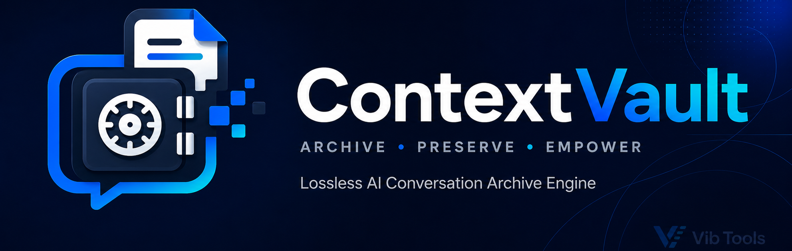

<p align="center">
  
</p>

# ContextVault

ContextVault is an open-source Windows desktop application from **Vib Tools** that preserves fully loaded ChatGPT conversations as portable, lossless, integrity-checked, RAG-ready archives.

Version **1.0.0** follows the frozen project specifications in `project/`: CustomTkinter UI, Playwright automation against official Google Chrome Stable, a persistent automation profile, a dedicated browser worker, deterministic JSON, complete asset extraction, archive validation, Nuitka OneDir packaging, and GitHub Actions release automation.

## Core capabilities

- Launch official Google Chrome Stable with a ContextVault-owned persistent profile, use an explicitly configured non-standard profile root, or connect over CDP.
- Scan ChatGPT conversation links and progressively load a selected conversation.
- Preserve ordered messages, roles, timestamps, HTML, Markdown, plain text, code, images, attachments, tables, and citations.
- Generate mandatory metadata, summaries, search indexes, statistics, logs, hashes, and RAG documents.
- Validate structure, schemas, asset references, message sequencing, file size, and SHA-256 integrity.
- Manage archives, export history, settings, logs, cancellation, and current-session resume from one dark-mode CustomTkinter window.
- Produce a portable Windows x64 Nuitka OneDir ZIP through the official workflow.

## Architecture

```text
CustomTkinter UI
    ↓
ApplicationController
    ↓
TaskManager / queue / ThreadPoolExecutor
    ↓
BrowserSessionWorker (dedicated lane + asyncio loop)
    ↓
Playwright + Google Chrome Stable
    ↓
ConversationParser + Pydantic models
    ↓
ArchiveBuilder / RagBuilder / ArchiveValidator
    ↓
Portable ContextVault archive
```

Browser exports are serialized so Playwright objects never leave their owning worker thread. The UI receives typed queue events and never performs browser, parsing, archive, or filesystem-heavy work directly.

## Requirements

- Windows 10 or Windows 11, 64-bit
- Python 3.12+ for source execution
- Google Chrome Stable
- A manually authenticated ChatGPT session in the ContextVault automation profile or an explicitly configured non-standard Chrome profile

ContextVault does not bundle Chromium, does not request ChatGPT credentials, and does not introduce cloud synchronization, SQLite, embeddings, semantic search, plugins, or an in-app archive viewer in version 1.0.

## Source setup

```powershell
py -3.12 -m venv .venv
.venv\Scripts\Activate.ps1
python -m pip install -r requirements.lock
python scripts/test/check_environment.py
python scripts/test/run_tests.py
python src/app.py
```

`run.bat` is the supported repository launcher. Do not run `playwright install`; the frozen browser architecture uses the installed Google Chrome channel.

## Basic workflow

1. Open **Settings** and configure the profile name, CDP endpoint, export directory, and asset options. Leave **Browser Profile Root** blank to use ContextVault's persistent isolated profile.
2. Select **Launch Chrome**. Use **Connect** only for a Chrome instance that you intentionally started with remote debugging and a non-standard user-data directory.
3. Log in manually inside the ContextVault Chrome window and open ChatGPT. The session persists for later launches.
4. Select **Scan**, choose conversations, and export.
5. Use **Archives** to open Markdown, open the folder, validate, rebuild a summary, or delete an archive.
6. Review **Logs** and **Export History** for operational details.

## Archive layout

```text
archive-name/
├── manifest.json
├── metadata.json
├── conversation.json
├── conversation.md
├── summary.json
├── search-index.json
├── statistics.json
├── assets/
│   ├── code/
│   ├── images/
│   ├── attachments/
│   ├── tables/
│   └── citations/
├── rag/
│   ├── chunks.json
│   ├── documents.json
│   ├── keywords.json
│   └── chunk-map.json
└── logs/
    ├── export.log
    └── validation.log
```

All JSON output is UTF-8 without BOM, four-space indented, camelCase, root-object based, and versioned. RAG chunks preserve message boundaries.

## Testing and audit commands

```powershell
python scripts/test/checkmodules.py
python scripts/test/check_environment.py
python scripts/test/run_tests.py
```

The 39-test automated suite covers parsing, repeated-message preservation, opaque attachments, archive generation/compression, deep consistency validation, rollback, atomic writes, cancellation, browser-worker lifecycle, settings/history, path security, repository configuration, AST validity, and architectural import boundaries.

## Windows build and release

Install the locked build tool after runtime dependencies:

```powershell
python -m pip install -r requirements.lock -r requirements-build.lock
python scripts/build/build_windows.py
python scripts/release/package_release.py
```

The build script requires Windows x64 and an active Visual Studio Build Tools/MSVC environment. It reads `nuitka.toml`, generates the detected Nuitka `build/*.dist/ContextVault.exe` output, and the release packager creates:

```text
artifacts/ContextVault-Windows-x64.zip
artifacts/ContextVault-Windows-x64.zip.sha256
```

`.github/workflows/release.yml` performs the official Windows test, build, ZIP verification, artifact upload, and tag-triggered GitHub Release publication.

## Documentation

Start at [`docs/index.md`](docs/index.md). Frozen engineering requirements and architecture decisions are retained under [`project/`](project/). Implementation traceability is documented in [`docs/developer/requirements-traceability.md`](docs/developer/requirements-traceability.md), with the forensic findings in [`docs/developer/forensic-audit-report.md`](docs/developer/forensic-audit-report.md) and all 124 release gates in [`docs/developer/release-validation.md`](docs/developer/release-validation.md).

## Security and privacy

ContextVault uses the selected local Chrome profile and authenticated browser context. It does not store passwords. Export paths and archive references are validated, writes use staging/atomic replacement, and untrusted filenames are normalized for Windows portability. Report vulnerabilities through [`SECURITY.md`](SECURITY.md).

## License

MIT License. See [`LICENSE`](LICENSE).
